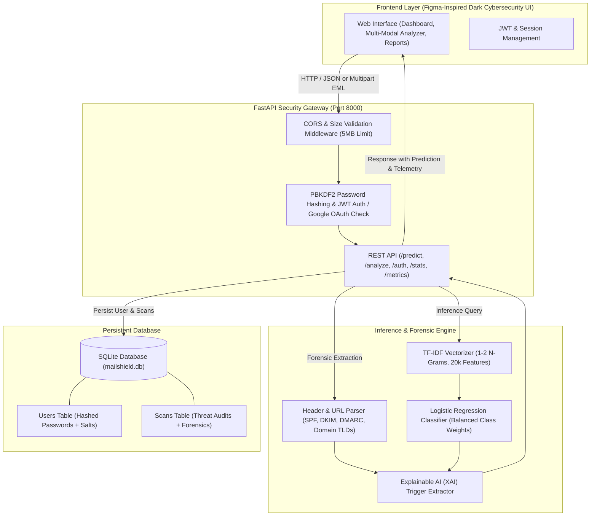
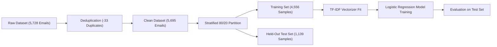
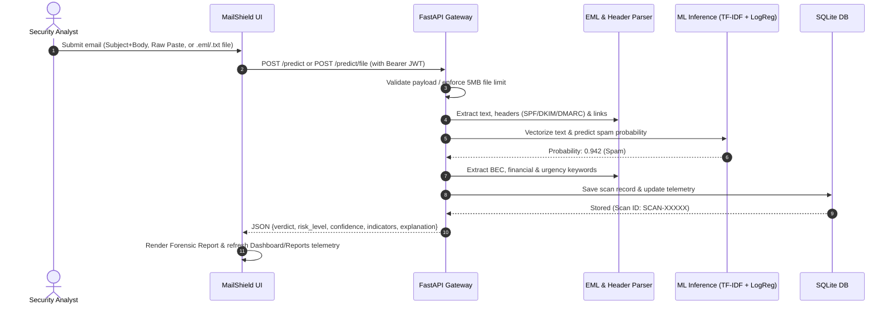

# MailShield AI — System Architecture & Technical Review

## 1. System Overview & Architecture

MailShield AI is a modern enterprise email threat defense system designed to inspect, detect, and quarantine email-based cybersecurity threats, including Business Email Compromise (BEC), wire transfer fraud, credential harvesting portals, and authentication spoofing.

---

## 2. Dataset Utilization & Machine Learning Pipeline

### Dataset Composition
The classifier was trained on an audited, labeled email dataset:
- **Raw Corpus**: 5,728 labeled emails
- **Duplicate Removal**: 33 duplicate records identified and removed
- **Final Clean Dataset**: 5,695 emails
  - **Legitimate Messages**: 4,327 (76.0%)
  - **Spam & Malicious Messages**: 1,368 (24.0%)

### Evaluation Benchmark Metrics (Held-Out Test Set)
Evaluated on 1,139 held-out stratified test samples:
- **Accuracy**: **98.51%**
- **Spam Precision**: **100.0%** (0 false alarms on the test set)
- **Spam Recall**: **93.80%** (257 of 274 malicious samples caught)
- **Spam F1-Score**: **96.80%**
- **ROC-AUC**: **0.9996**

---

## 3. API Sequence Flow

---

## 4. Security & Hardening Architecture

1. **Authentication & Password Storage**:
   - Passwords hashed using `PBKDF2-HMAC-SHA256` with 120,000 iterations and per-user 16-byte cryptographic salts.
   - Authentication tokens generated as HMAC-SHA256 signed JWTs with expiration timestamps.
   - Protection against enumeration and brute-force via consistent error responses.
2. **Safe Multi-Modal File Handling**:
   - Strictly validates `.txt` and `.eml` extensions and MIME types.
   - Safe in-memory parsing using Python's `email.message_from_bytes` parser.
   - 5MB maximum file size limit strictly enforced (`413 Payload Too Large`).
   - Files and attachments are **never executed** or written to executable OS directories.
3. **Zero Dummy Statistics Policy**:
   - All dashboard cards, threat vector counts, classification donuts, and weekly volume charts are derived strictly from database queries.
   - Elegant empty states displayed when zero scans are recorded.

---

## 5. Feasibility & Scalability

### Feasibility
- **Zero Heavy Infrastructure Dependencies**: Uses lightweight, standard scikit-learn models and SQLite which execute with sub-50ms latency per request on commodity CPUs.
- **Client-Side & Server-Side Harmony**: Frontend communicates through clean REST endpoints (`/predict`, `/analyze`, `/auth`, `/stats`, `/metrics`).

### Scalability Roadmap
- **Database Scaling**: SQLite database easily switches to PostgreSQL or Amazon RDS via SQLAlchemy by swapping the connection URL.
- **Model Serving**: The TF-IDF + Logistic Regression pipeline is thread-safe and can be served across multiple Uvicorn workers behind an Nginx or AWS ALB reverse proxy.
- **Containerization**: Single Dockerfile with FastAPI backend and lightweight static frontend container.

---

## 6. Implementation Progress Checklist

- [x] **Branding & Dark Cybersecurity Theme**: Fully preserved Figma visual design.
- [x] **Authentication**: Working registration, secure PBKDF2 hashing, login validation, session tokens, and protected routes.
- [x] **User Personalization**: Displays logged-in user's name, email, and avatar initials.
- [x] **Google OAuth Configuration**: Client-side button with server configuration check and helpful modal messaging.
- [x] **Multi-Modal Inspection**: Structured Subject+Body, Raw Paste, and safe `.eml`/`.txt` drag-and-drop file upload.
- [x] **Explainable AI (XAI)**: Dynamic content-derived threat keyword explanations.
- [x] **Real ML Model**: Production TF-IDF + Logistic Regression model (98.51% accuracy, 100% precision).
- [x] **Zero Dummy Data**: Dynamic telemetry and clean empty states across Dashboard and Reports.
- [x] **Automated Test Coverage**: 100% test pass rate across authentication, predictions, persistence, and telemetry.
